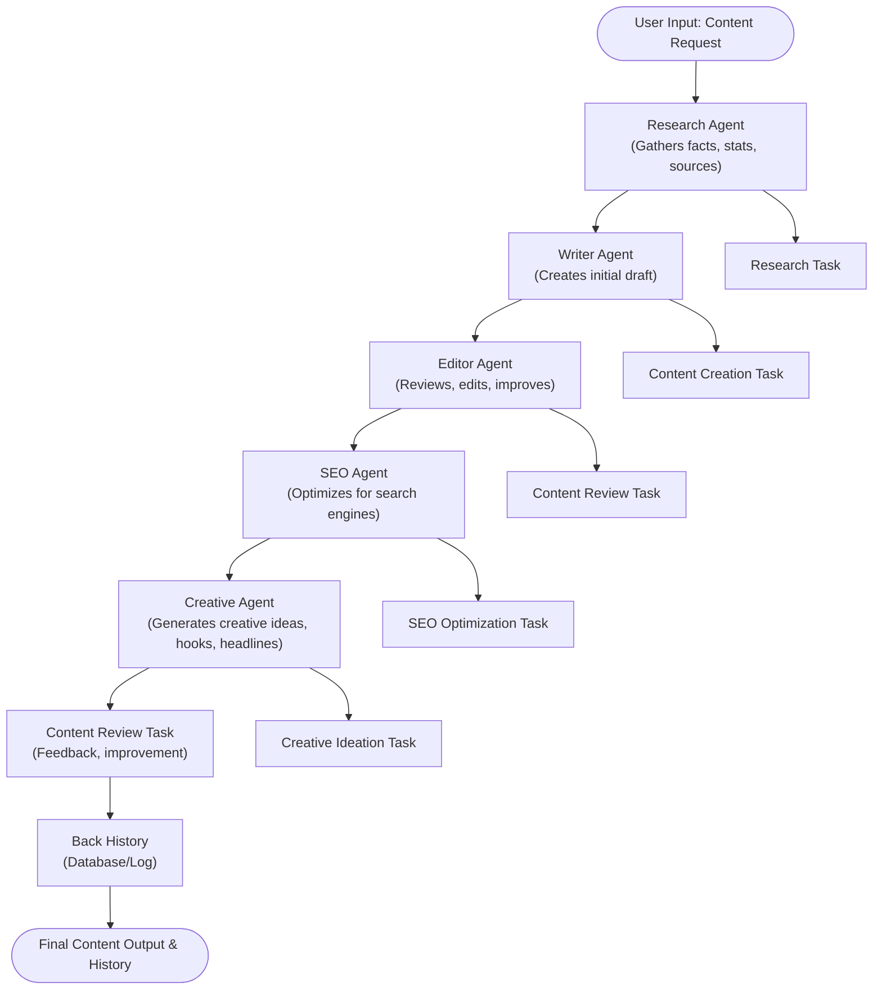

# AI Content Studio

AI Content Studio is a modular, secure, and extensible platform for automated content creation, review, SEO optimization, research, and creative ideation. It leverages CrewAI and multiple specialized agents to deliver high-quality, engaging, and SEO-optimized content.

## Key Features
- **Modular Agents:** Writer, Editor, SEO Specialist, Researcher, and Creative Ideation agents, each with a clear role.
- **Task-Oriented Workflow:** Each agent is paired with tasks for content creation, review, SEO, research, and ideation.
- **Back History:** All content and actions are logged for traceability and improvement.
- **Security:** Environment-based secrets, input validation, and modular code for easy auditing.
- **Extensible:** Add new agents or tasks as needed.

## Project Structure
```
app/
  agents/         # Specialized AI agents (Writer, Editor, SEO, Research, Creative)
  tasks/          # Task definitions and workflows
  config.py       # Environment and settings
.env.example      # Environment variable template
requirements.txt  # Python dependencies
```

## Agents & Tasks
- **WriterAgent:** Drafts content based on research and requirements.
- **EditorAgent:** Reviews and improves drafts for clarity, grammar, and engagement.
- **SEOAgent:** Optimizes content for search engines, suggests keywords, and meta tags.
- **ResearchAgent:** Gathers facts, statistics, and credible sources.
- **CreativeAgent:** Generates creative ideas, hooks, and headlines.

## Example Workflow
1. **User Input:** Provide a topic and requirements.
2. **ResearchAgent:** Gathers facts and insights.
3. **WriterAgent:** Drafts the initial content.
4. **EditorAgent:** Reviews and improves the draft.
5. **SEOAgent:** Optimizes for SEO and generates meta tags.
6. **CreativeAgent:** Suggests creative angles and headlines.
7. **Back History:** All steps and outputs are logged.

## Flowchart


## Security & Guardrails
- All secrets and API keys are loaded from environment variables.
- Input validation is enforced at every agent and task.
- Modular code for easy auditing and extension.

## Getting Started
1. Copy `.env.example` to `.env` and fill in your secrets.
2. Install dependencies:
   ```bash
   pip install -r requirements.txt
   ```
3. Run your application or integrate the agents/tasks as needed.

## Extending the Studio
- Add new agents in `app/agents/` and tasks in `app/tasks/`.
- Follow the modular and secure coding style for all new components.

---

*Built with CrewAI, LangChain, and a focus on modular, secure, and extensible AI content workflows.*
